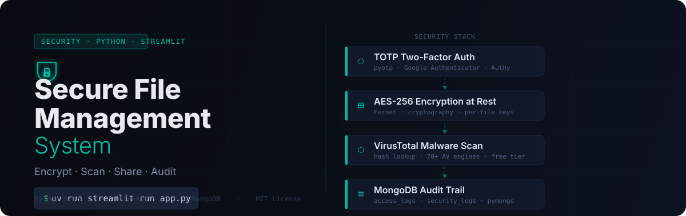

<p align="center">
  
</p>

<p align="center">
  <a href="https://www.python.org/downloads/"></a>
  <a href="https://streamlit.io"></a>
  <a href="https://www.mongodb.com/atlas"></a>
  <a href="LICENSE"></a>
</p>

---

Upload a file. It gets scanned for malware by 70+ antivirus engines, encrypted with AES-256 (per-file keys), and stored. Share it with teammates using granular permissions. Every action is logged. All of this runs in a browser with a single command.

---

## Quick Start

**Prerequisites:** Python 3.12+, MongoDB URI, VirusTotal API key.

```bash
# 1. Clone and enter the project
git clone https://github.com/Tanishquppal220/Secure-File-Managment-System.git
cd Secure-File-Managment-System

# 2. Set up the environment with uv
uv venv && source .venv/bin/activate   # Windows: .venv\Scripts\Activate.ps1
uv sync

# 3. Create secrets file
mkdir -p .streamlit
cat > .streamlit/secrets.toml << 'EOF'
[mongodb]
MONGODB_URI      = "mongodb+srv://<user>:<pass>@<cluster>/?retryWrites=true&w=majority"
DATABASE_NAME    = "secure_file_mgmt"

[api]
VIRUSTOTAL_API_KEY = "your_virustotal_api_key_here"

[app]
MAX_FILE_SIZE_MB    = 50
ALLOWED_FILE_TYPES  = "pdf,txt,docx,xlsx,jpg,png,zip"

[email]
SMTP_SERVER      = "smtp.gmail.com"
SMTP_PORT        = 587
SENDER_EMAIL     = "your.email@gmail.com"
SENDER_PASSWORD  = "your_16_char_app_password"
EOF

# 4. Run
uv run streamlit run app.py
```

Open `http://localhost:8501` in your browser.

---

## How It Works

Every file passes through four security layers in sequence:

| Layer | Mechanism | Implementation |
|---|---|---|
| **Identity** | TOTP two-factor authentication | `pyotp`, bcrypt password hashing |
| **Encryption** | AES-256 (Fernet) at rest, per-file keys | `cryptography` library |
| **Threat detection** | VirusTotal hash lookup + file scan | 70+ AV engines via REST API |
| **Audit** | Immutable access and security event logs | MongoDB `access_logs` + `security_logs` |

File sharing uses explicit per-user permissions (`read`, `download`, `write`, `share`). Accounts lock after repeated failed logins.

---

## Prerequisites

| Requirement | Where to get it |
|---|---|
| Python 3.12+ | [python.org](https://www.python.org/downloads/) |
| `uv` package manager | `curl -LsSf https://astral.sh/uv/install.sh \| sh` |
| MongoDB Atlas URI | [mongodb.com/atlas](https://www.mongodb.com/atlas) (free tier works) |
| VirusTotal API key | [virustotal.com](https://www.virustotal.com/) → profile → API key |
| Gmail App Password | Google Account → Security → App Passwords (16-char) |

---

## Configuration Reference

All secrets live in `.streamlit/secrets.toml` (gitignored — never committed).

```toml
[mongodb]
MONGODB_URI      = "mongodb+srv://..."   # Atlas connection string
DATABASE_NAME    = "secure_file_mgmt"

[api]
VIRUSTOTAL_API_KEY = "..."               # Free tier: 4 req/min, 500 req/day

[app]
MAX_FILE_SIZE_MB   = 50
ALLOWED_FILE_TYPES = "pdf,txt,docx,xlsx,jpg,png,zip"

[email]
SMTP_SERVER     = "smtp.gmail.com"
SMTP_PORT       = 587
SENDER_EMAIL    = "..."                  # Gmail address
SENDER_PASSWORD = "..."                  # 16-char App Password (not your login password)
```

### Getting a Gmail App Password

1. Enable **2-Step Verification** in your Google Account.
2. Go to [myaccount.google.com/apppasswords](https://myaccount.google.com/apppasswords).
3. Create a password for **Mail → Other** (e.g., "Secure File Mgmt").
4. Copy the 16-character result into `SENDER_PASSWORD`.

---

## Project Structure

```
Secure-File-Managment-System/
├── app.py                    # Streamlit entry point
├── pages/
│   ├── auth.py               # Login, register, 2FA setup
│   ├── dashboard.py          # File management view
│   ├── upload.py             # Upload → scan → encrypt flow
│   ├── shared.py             # Files shared with you
│   └── settings.py           # Password and 2FA settings
├── src/
│   ├── auth/
│   │   ├── auth_manager.py   # Auth logic, account locking
│   │   ├── password_manager.py  # bcrypt hashing
│   │   └── two_factor.py     # TOTP (pyotp)
│   ├── database/
│   │   ├── connection.py     # MongoDB connection pool
│   │   └── models.py         # Document schemas
│   ├── file_ops/
│   │   └── file_manager.py   # Encrypt, upload, download, share
│   ├── threat_detection/
│   │   ├── malware_scanner.py      # Base scanner interface
│   │   └── virustotal_scanner.py   # VirusTotal REST integration
│   └── utils/
│       ├── encryption.py     # AES helpers
│       ├── logger.py         # Rotating daily logs
│       └── validators.py     # Input validation
├── .streamlit/secrets.toml   # Secrets (gitignored)
├── encrypted_files/          # Encrypted storage (gitignored)
├── logs/                     # Application logs (gitignored)
└── pyproject.toml            # Dependencies (managed with uv)
```

---

## Database Schema

<details>
<summary><strong>users</strong> — account info and auth state</summary>

```json
{
  "username":              "String (unique)",
  "email":                 "String (unique)",
  "password_hash":         "String (bcrypt)",
  "role":                  "'user' | 'admin'",
  "two_fa_enabled":        "Boolean",
  "two_fa_secret":         "String (Base32 TOTP secret)",
  "created_at":            "DateTime",
  "last_login":            "DateTime",
  "is_active":             "Boolean",
  "failed_login_attempts": "Integer",
  "account_locked_until":  "DateTime"
}
```
</details>

<details>
<summary><strong>files</strong> — metadata, encryption keys, sharing permissions</summary>

```json
{
  "file_id":           "String (UUID)",
  "filename":          "String",
  "owner":             "String (username)",
  "encrypted_path":    "String",
  "encryption_key":    "String (Base64 Fernet key)",
  "file_size":         "Integer (bytes)",
  "mime_type":         "String",
  "uploaded_at":       "DateTime",
  "is_shared":         "Boolean",
  "shared_with":       [{ "username": "String", "permissions": ["read","download","write","share"], "shared_at": "DateTime" }],
  "tags":              ["String"],
  "is_deleted":        "Boolean",
  "threat_scan_status":"'clean' | 'infected' | 'pending'",
  "threat_scan_result":"Object (VirusTotal response)"
}
```
</details>

<details>
<summary><strong>access_logs</strong> and <strong>security_logs</strong> — full audit trail</summary>

```json
// access_logs — every login, upload, download, share
{
  "timestamp": "DateTime",
  "user":      "String",
  "action":    "String",
  "file_id":   "String (optional)",
  "details":   "String",
  "status":    "'success' | 'failed'"
}

// security_logs — malware detections and suspicious events
{
  "timestamp":    "DateTime",
  "event_type":   "String",
  "threat_level": "'low' | 'medium' | 'high' | 'critical'",
  "user":         "String (optional)",
  "file_id":      "String (optional)",
  "details":      "String",
  "resolved":     "Boolean"
}
```
</details>

---

## Troubleshooting

| Issue | Fix |
|---|---|
| **VirusTotal connection error** | Check `VIRUSTOTAL_API_KEY` in `secrets.toml`. Confirm internet access. |
| **`cannot import name 'PBKDF2'`** | Run `uv sync` to update `cryptography`. |
| **Shared file not visible** | Sharing uses exact username matching. Confirm the correct username was used. |
| **MongoDB connection fails** | Verify `MONGODB_URI` and whitelist your IP in Atlas → Network Access. |
| **Gmail SMTP auth fails** | Use a 16-char App Password, not your account password. 2-Step Verification must be ON. |

---

## Security Notes

- **Secrets** — `.streamlit/secrets.toml`, `encrypted_files/`, and `logs/` are gitignored. Never commit API keys.
- **Encryption** — files are encrypted at rest with per-file AES-256 (Fernet) keys stored in MongoDB.
- **Rate limits** — VirusTotal free tier: 4 requests/min, 500 requests/day. The app handles this gracefully.
- **Account protection** — accounts lock after repeated failed login attempts.

---

## License

MIT — see [LICENSE](LICENSE) for details.
